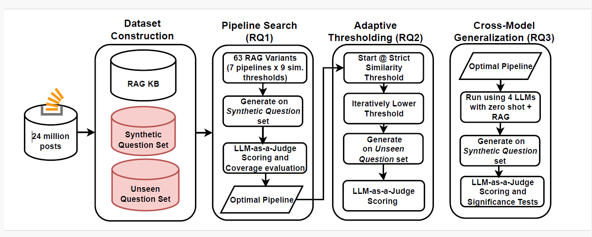

# Never Come Up Empty: Adaptive HyDE Retrieval for Improving LLM Developer Support
# Abstract
Large Language Models (LLMs) have shown promise in assisting developers with code-related questions; however, LLMs carry the risk of generating unreliable answers. To address this, Retrieval-Augmented Generation (RAG) has been proposed to reduce the unreliability (i.e., hallucinations) of LLMs. However, designing effective pipelines remains challenging due to numerous design choices. In this paper, we construct a retrieval corpus of over 3 million Java and Python related Stack Overflow posts with accepted answers, and explore various RAG pipeline designs to answer developer questions, evaluating their effectiveness in generating accurate and reliable responses. More specifically, we (1) design and evaluate 7 different RAG pipelines and 63 pipeline variants to answer questions that have historically similar matches, and (2) address new questions without any close prior matches by automatically lowering the similarity threshold during retrieval, thereby increasing the chance of finding partially relevant context and improving coverage for unseen cases. We find that implementing a RAG pipeline combining hypothetical-documentation-embedding (HyDE) with the full-answer context performs best in retrieving and answering similar content for Stack Overflow questions. Finally, we apply our optimal RAG pipeline to 4 open-source LLMs and compare the results to their zero-shot performance. Our findings show that RAG with our optimal RAG pipeline consistently outperforms zero-shot baselines across models, achieving higher scores for helpfulness, correctness, and detail with LLM-as-a-judge. These findings demonstrate that our optimal RAG pipelines robustly enhance answer quality for a wide range of developer queries—including both previously seen and novel questions—across different LLMs.

# Experimental Workflow

## Extract and Process Stack Overflow Dump

Please download the Stack Overflow data dump from [Archive.org Stack Exchange Data Dump](https://archive.org/details/stackexchange).

Specifically, extract the `Posts.xml` file and place it **in the same directory as this project**.

> **Note:**  
> Due to the large file size, we do not upload intermediate processed files. These files will be generated automatically when you run the pipeline.

## RQ1: Which retrieval approach configurations yield the highest response quality in LLM-generated answers?
## RQ2: How well does adaptive HyDE retrieval perform on novel questions outside the training corpus?
## RQ3: How does our proposed RAG pipeline perform across different LLMs?
## Extra
